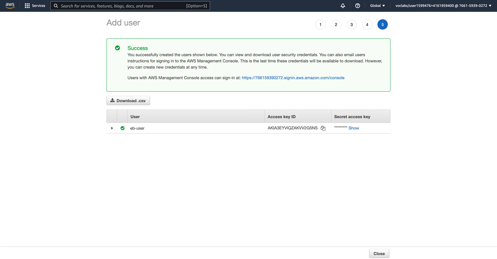
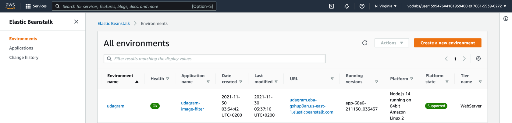

# Udagram Image Filtering Microservice

Udagram is a simple cloud application developed alongside the Udacity Cloud Engineering Nanodegree. It allows users to register and log into a web client, post photos to the feed, and process photos using an image filtering microservice.

## Table of Content
1. [Access Application](#access-application)
2. [Deployment - Getting Started](#deployment---getting-started)
   1. [Create IAM User](#create-iam-user)
   2. [Setup Application using AWS Elastic Beanstalk](#setup-application-using-aws-elastic-beanstalk)
3. [Local - Getting Started](#local---getting-started)
   1. [Setup Node Environment](#setup-node-environment)
4. [Resources](#resources)

## Access Application

AWS EB URL: http://udagram.eba-gxhup9an.us-east-1.elasticbeanstalk.com/

Test API through this [link](http://udagram.eba-gxhup9an.us-east-1.elasticbeanstalk.com/filteredimage?image_url=https://sasa94s.github.io/deploy-a-static-website-on-aws/docs/images/website-homepage.png), 
or check [Postman collection](docs/udagram-final.postman_collection.json).

**Note:** 
> 30/11/2021: Website can be accessed through AWS with limited access. 
> (Deployment status can be found [here](docs/images/deployment_screenshot))

## Deployment - Getting Started

### Create IAM User
1. Go to Amazon IAM
2. Go to Users page
3. Click on "Add user"
4. Check "Programmatic access" option
5. Click on "Next: Permissions"

6. Select "Attach existing policies directly"
7. Check "AdministratorAccess-AWSElasticBeanstalk" IAM policy
8. Click on "Next: Tags"

9. Click on "Next: Review"
10. Click on "Create user"
11. Save credentials


### Setup Application using AWS Elastic Beanstalk
1. Install AWS CLI v2
2. Run `aws configure`
3. Enter aws credentials
4. Run `eb init`
5. Enter Application Name `udagram-image-filter`
6. Select runtime environment and platform `Node.js 14 running on 64bit Amazon Linux 2`
    ```shell
    Enter Application Name
    (default is "udagram-image-filter"):
    Application udagram-image-filter has been created.
    
    It appears you are using Node.js. Is this correct?
    (Y/n): y
    Select a platform branch.
    1) Node.js 14 running on 64bit Amazon Linux 2
    2) Node.js 12 running on 64bit Amazon Linux 2
    3) Node.js 10 running on 64bit Amazon Linux 2 (Deprecated)
    4) Node.js running on 64bit Amazon Linux (Deprecated)
    (default is 1): 1
    
    Do you wish to continue with CodeCommit? (Y/n): n
    Do you want to set up SSH for your instances?
    (Y/n): y
    
    Select a keypair.
    1) vockey
    2) [ Create new KeyPair ]
    (default is 1): 
    ```
7. Add the below line in `config.yml` file
   ```shell
   deploy:
     artifact: ./www/Archive.zip
   ```
8. Run `npm run build`
9. Run `eb create udagram`
10. Continue with default options
    ```shell
    Uploading udagram-image-filter/app-68a6-211130_033437.zip to S3. This may take a while.
    Upload Complete.
    Environment details for: udagram
      Application name: udagram-image-filter
      Region: us-east-1
      Deployed Version: app-68a6-211130_033437
      Environment ID: e-jgqrbr3sp3
      Platform: arn:aws:elasticbeanstalk:us-east-1::platform/Node.js 14 running on 64bit Amazon Linux 2/5.4.8
      Tier: WebServer-Standard-1.0
      CNAME: UNKNOWN
      Updated: 2021-11-30 01:34:42.913000+00:00
    Printing Status:
    2021-11-30 01:34:41    INFO    createEnvironment is starting.
    2021-11-30 01:34:43    INFO    Using elasticbeanstalk-us-east-1-766159390272 as Amazon S3 storage bucket for environment data.
    2021-11-30 01:35:04    INFO    Created security group named: sg-0c01b50527d5590ea
    2021-11-30 01:35:19    INFO    Created load balancer named: awseb-e-j-AWSEBLoa-1KW6NWGOYC50W
    2021-11-30 01:35:19    INFO    Created security group named: awseb-e-jgqrbr3sp3-stack-AWSEBSecurityGroup-YHVFNBCA3JQM
    2021-11-30 01:35:19    INFO    Created Auto Scaling launch configuration named: awseb-e-jgqrbr3sp3-stack-AWSEBAutoScalingLaunchConfiguration-RVS8VSPS9GDM
    2021-11-30 01:36:23    INFO    Created Auto Scaling group named: awseb-e-jgqrbr3sp3-stack-AWSEBAutoScalingGroup-9FPD3HFFS9E2
    2021-11-30 01:36:23    INFO    Waiting for EC2 instances to launch. This may take a few minutes.
    2021-11-30 01:36:23    INFO    Created Auto Scaling group policy named: arn:aws:autoscaling:us-east-1:766159390272:scalingPolicy:8993c584-6b12-47bb-9fce-c3eb09e1e153:autoScalingGroupName/awseb-e-jgqrbr3sp3-stack-AWSEBAutoScalingGroup-9FPD3HFFS9E2:policyName/awseb-e-jgqrbr3sp3-stack-AWSEBAutoScalingScaleUpPolicy-DB950NHEMGV0
    2021-11-30 01:36:23    INFO    Created Auto Scaling group policy named: arn:aws:autoscaling:us-east-1:766159390272:scalingPolicy:ce54e87f-dbad-4d27-bcc9-1d7e6212b9c5:autoScalingGroupName/awseb-e-jgqrbr3sp3-stack-AWSEBAutoScalingGroup-9FPD3HFFS9E2:policyName/awseb-e-jgqrbr3sp3-stack-AWSEBAutoScalingScaleDownPolicy-1IBH4VNPOYJSN
    2021-11-30 01:36:23    INFO    Created CloudWatch alarm named: awseb-e-jgqrbr3sp3-stack-AWSEBCloudwatchAlarmHigh-1XZITLF9XWKXL
    2021-11-30 01:36:23    INFO    Created CloudWatch alarm named: awseb-e-jgqrbr3sp3-stack-AWSEBCloudwatchAlarmLow-1NN7RXH6R6AXY
    2021-11-30 01:36:59    INFO    Instance deployment completed successfully.
    2021-11-30 01:37:15    INFO    Application available at udagram.eba-gxhup9an.us-east-1.elasticbeanstalk.com.
    2021-11-30 01:37:16    INFO    Successfully launched environment: udagram
    ```
11. Go to Amazon Elastic Beanstalk
12. Check "Environments" page

13. Check "Application" page

14. Run `eb open`

15. (Optional) If the code is modified after deployment, you can run `eb deploy`
   ```shell
   Uploading udagram-image-filter/app-4999-211130_104022.zip to S3. This may take a while.
   Upload Complete.
   2021-11-30 08:40:25    INFO    Environment update is starting.      
   2021-11-30 08:40:29    INFO    Deploying new version to instance(s).
   2021-11-30 08:40:52    INFO    Instance deployment completed successfully.
   2021-11-30 08:40:56    INFO    New application version was deployed to running EC2 instances.
   2021-11-30 08:40:56    INFO    Environment update completed successfully.
   ```
16. (Optional) If you want to remove all resources created and terminate, you can run `eb terminate udagram`
   ```shell
   The environment "udagram" and all associated instances will be terminated.
   To confirm, type the environment name: udagram
   2021-11-30 10:31:34    INFO    terminateEnvironment is starting.
   2021-11-30 10:31:51    INFO    Deleted CloudWatch alarm named: awseb-e-jgqrbr3sp3-stack-AWSEBCloudwatchAlarmHigh-1XZITLF9XWKXL 
   2021-11-30 10:31:52    INFO    Deleted CloudWatch alarm named: awseb-e-jgqrbr3sp3-stack-AWSEBCloudwatchAlarmLow-1NN7RXH6R6AXY 
   2021-11-30 10:31:52    INFO    Deleted Auto Scaling group policy named: arn:aws:autoscaling:us-east-1:766159390272:scalingPolicy:8993c584-6b12-47bb-9fce-c3eb09e1e153:autoScalingGroupName/awseb-e-jgqrbr3sp3-stack-AWSEBAutoScalingGroup-9FPD3HFFS9E2:policyName/awseb-e-jgqrbr3sp3-stack-AWSEBAutoScalingScaleUpPolicy-DB950NHEMGV0
   2021-11-30 10:31:52    INFO    Deleted Auto Scaling group policy named: arn:aws:autoscaling:us-east-1:766159390272:scalingPolicy:ce54e87f-dbad-4d27-bcc9-1d7e6212b9c5:autoScalingGroupName/awseb-e-jgqrbr3sp3-stack-AWSEBAutoScalingGroup-9FPD3HFFS9E2:policyName/awseb-e-jgqrbr3sp3-stack-AWSEBAutoScalingScaleDownPolicy-1IBH4VNPOYJSN
   2021-11-30 10:31:52    INFO    Waiting for EC2 instances to terminate. This may take a few minutes.
   2021-11-30 10:35:56    INFO    Deleted Auto Scaling group named: awseb-e-jgqrbr3sp3-stack-AWSEBAutoScalingGroup-9FPD3HFFS9E2
   2021-11-30 10:35:56    INFO    Deleted load balancer named: awseb-e-j-AWSEBLoa-1KW6NWGOYC50W
   2021-11-30 10:36:12    INFO    Deleted Auto Scaling launch configuration named: awseb-e-jgqrbr3sp3-stack-AWSEBAutoScalingLaunchConfiguration-RVS8VSPS9GDM
   2021-11-30 10:36:12    INFO    Deleted security group named: awseb-e-jgqrbr3sp3-stack-AWSEBSecurityGroup-YHVFNBCA3JQM
   2021-11-30 10:36:12    INFO    Deleted security group named: sg-0c01b50527d5590ea
   2021-11-30 10:36:29    INFO    Deleting SNS topic for environment udagram.
   2021-11-30 10:36:30    INFO    terminateEnvironment completed successfully.
   ```

## Local - Getting Started

### Setup Node Environment

You'll need to create a new node server. Open a new terminal within the project directory and run:

1. Initialize a new project: `npm i`
2. run the development server with `npm run dev`

## Resources
- [How to deploy a Node.js app to the AWS Elastic Beanstalk](https://www.freecodecamp.org/news/how-to-deploy-a-node-js-app-to-the-aws-elastic-beanstalk-f150899ed977/)
